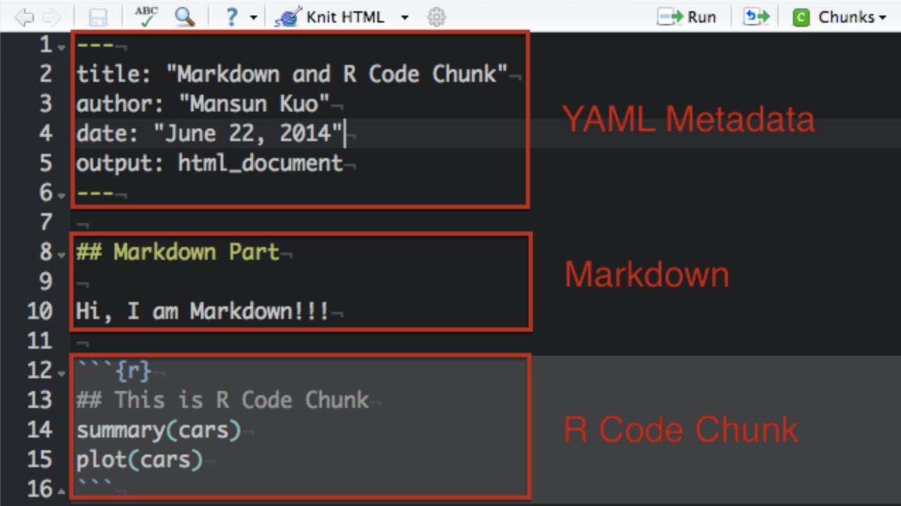
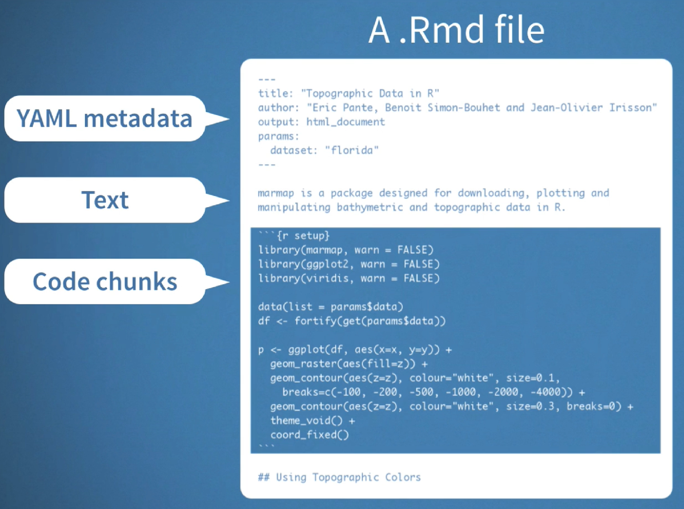
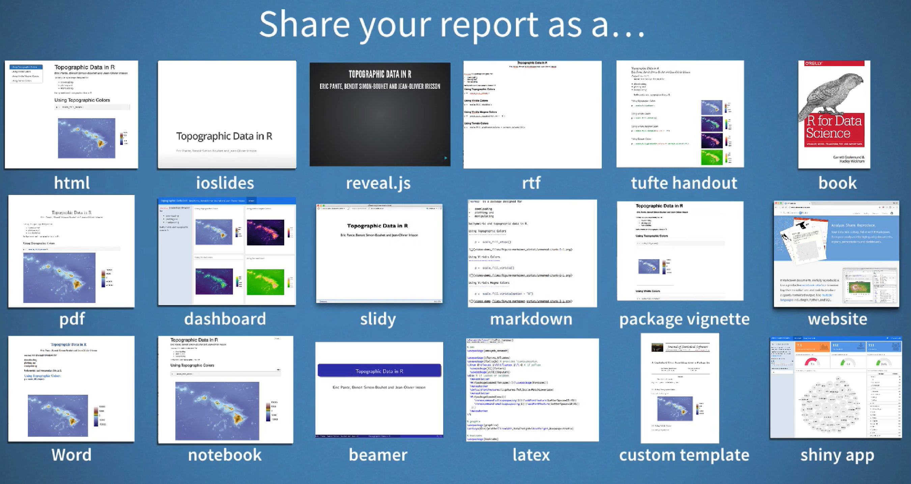
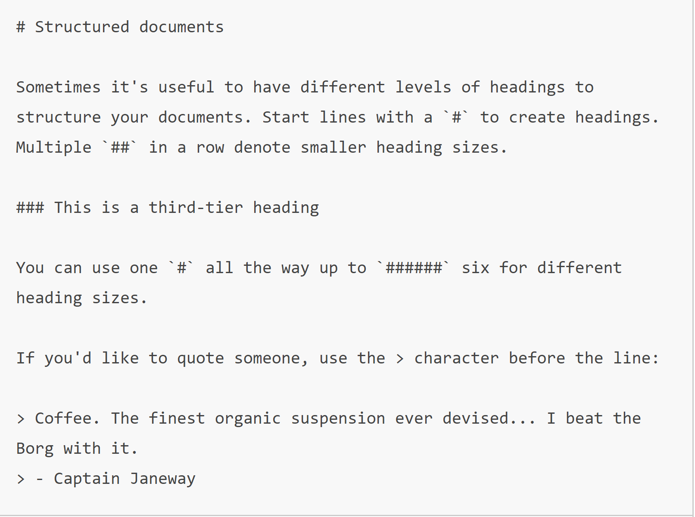
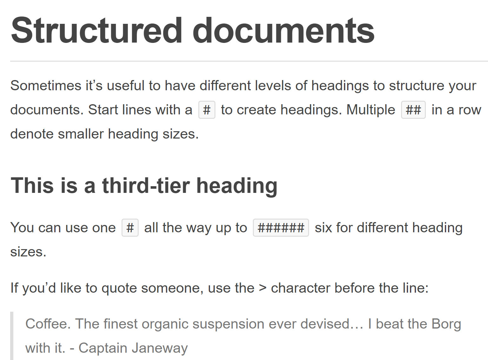

# Agenda

* Understand the structure of Rmarkdown documents

* Understanding output formats in Rmarkdown

* Understand coding in the Rmarkdown environment

* Understand the basic patterns in markdown syntax

* Building beautiful documents in Rmarkdown

# What is Rmarkdown?

## Structure of an Rmarkdown file

**An Rmarkdown file is a file with a ".Rmd" extension and in Rstudio it looks as below**




**So, in general expect three different pieces in the Rmarkdown file**

1) YAML metadata (- - -) - details the output and some metadata related to the file

2) Text and Formatting - Text interminced with symbols that help format text in the output document

3) Code chunks and outputs (```) - Executable R code chunks with output, similar to code cells in jupyter notebook





**Why Rmarkdown??**

* Rmarkdown documents help you format and output your analysis and R code with ouput in beautiful and sometimes interactive documents



# YAML Headers in Rmarkdown

The YAML header defined by __key: value__ pairs between a pair of __- - -__ 


# Coding in Rmarkdown

## Code Chunk:
```{r}
#We write our code here
```
  

##  Code Chunk Options:

Chunk output can be customized with knitr options, arguments set in the {} of a chunk header:   

  * include = FALSE prevents code and results from appearing in the finished file. R Markdown still runs the code in the chunk, and the results can be used by other chunks.  
  * echo = FALSE prevents code, but not the results from appearing in the finished file. This is a useful way to embed figures.  
  * message = FALSE prevents messages that are generated by code from appearing in the finished file.  
  * warning = FALSE prevents warnings that are generated by code from appearing in the finished.  
  * fig.cap = "..." adds a caption to graphical results.  
  


## Lets write some R code now:

### View the data

```{r}

volcanic_data = read.csv("city.csv")

head(volcanic_data)

```


```{r echo = FALSE, results = 'asis'}

library(knitr)

kable(volcanic_data[1:6,], caption = "Volcanic data table in a neat way")

```

### What is the summary of the dataset

```{r}

summary(volcanic_data)

```

### Let us do a scatter plot

```{r}

plot(volcanic_data$City.1, volcanic_data$City.2)

```

# Basic patterns in Markdown Syntax

**Markdown is a lightweight and easy-to-use syntax for styling and formatting all forms of text.**

**Think of HTML but much more cleaner and easier to read, even without the output**

**How does Rstudio understand R and markdown combined together?**

## How Rmarkdown works
   

This may sound complicated, but R Markdown makes it extremely simple by encapsulating all of the above processing into a single render function.
  

## Markdown Syntax Basics

### Bold, Italics and both in Markdown


- Using Rmarkdown, we can bold text using **Bold and Beautiful** or __Bold and Beautiful__

- Now, for italic we have, *Smooth and Slant* or _Smooth and Silent_

- Combining both in single line _**Bold**_ and __*Silent*__

### Wiritng Sentences in Markdown

BLAH BALH BLAH!!!


### Block Quotes in Markdown

> Essentially, all models are wrong, but some are useful.   - George Box


### Embedding links in Markdown

[R studio's rmarkdown reference guide](http://rmarkdown.rstudio.com)


### Unorderd and Orderd Lists in Markdown


  
### Images in Markdown

Standard Deviation equation: 


### Latex in Markdown

* Mardown gives us the ability to write math equations using latex, a cheat sheet is available at [the following link](https://reu.dimacs.rutgers.edu/Symbols.pdf)

* The standard deviation is given by the following formula

$$\sigma = \sqrt{\frac{1}{N} \sum_{i=1}^N (x_i - \overline{x})^2}$$

#### Some other commonly used symbols 

+ **Sigma:**  $\sigma$  

+ **Pi:**  $\pi$   

+ **Alpha:**  $\alpha$  

+ **Lambda:**  $\lambda$   

+ **Greater than or equal to:**  $\ge$  

+ **Plus or minus:**  $\pm$  


## Finally, Headings in Markdown

* Markdown allows us to define headings using the hash symbol

* The size of the heading gets smaller when the number of hashes increase

* The table of contents are also generated using the number of hash symbols
  
  + "#" First level heading
  
  + "##" Second level sub heading
  
  + "###" Third level sub heading





#  References  
1. https://www.rstudio.com/wp-content/uploads/2015/02/rmarkdown-cheatsheet.pdf
2. http://rmarkdown.rstudio.com
