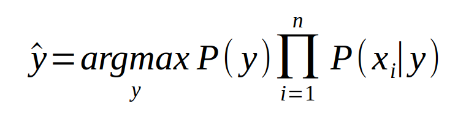
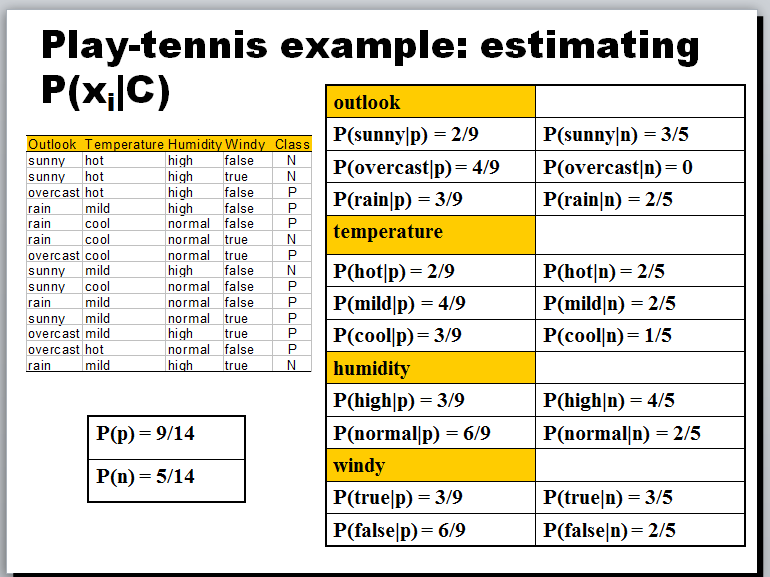

# Manually applying the Naive Bayes Classifier







### Classify the following new observation [rain, cool, normal, true]

### Classify the following new observation [sunny, mild, normal, false]


# Using R for Naive Bayes Classification

## Read and Understand the Data

* Using the dataset given to you, predict flight delays

```{r}

flight <- read.csv(file = "FlightDelays.csv", header = T, sep = ",")

```

```{r}

str(flight)

summary(flight)

```

## Data Pre-Processing

### Check for Missing Values

```{r}

sum(is.na(flight))

```

### Convert the attributes to appropriate types

* For the Naive Bayes implementation in the e1071 package, we have to send in our data in a categorical format, so we have to make the appropriate data type coversions.


```{r}

flight$Weather <- as.factor(flight$Weather)

flight$DAY_WEEK <- as.factor(flight$DAY_WEEK)

flight$Flight.Status <- ifelse(flight$Flight.Status == 0, "on-time", "delayed")

flight$Flight.Status <- as.factor(flight$Flight.Status)

```

* Categorize the departure time into bins based on your client's needs

```{r}

flight$levels <- ifelse(flight$DEP_TIME>=600 & flight$DEP_TIME<=1200, "level1",
                      ifelse(flight$DEP_TIME>=1200 & flight$DEP_TIME<=1800, "level2",
                             ifelse(flight$DEP_TIME>=1800 & flight$DEP_TIME<=2100, "level3", "level4")))

flight$levels <- as.factor(flight$levels)

```


```{r}

str(flight)

```

* The DEP_TIME column can now be dropped


```{r}

flight <- flight[ , !colnames(flight) %in% c("DEP_TIME")]

```


### Train-Test Split

* Use the createDataPartition() function from the caret package to split your data into train and test

```{r}

library(caret)

train_rows <- createDataPartition(y=flight$Flight.Status, p=0.7, list=F)

train <- flight[train_rows,]

test <- flight[-train_rows, ]

```


## Build the Naive Bayes Classifier

* We will use the naiveBayes() function from the e1071 package to build our Naive Bayes Classifier

```{r}

library(e1071)

model_nb <- naiveBayes(train$Flight.Status~., train)

```


```{r}

print(model_nb)

```


## Measure the Model Performace on test data

* Use the confusionMatrix() function from the caret package to look at the various performance metrics

```{r}

preds <- predict(model_nb, test)

confusionMatrix(data = preds, reference = test$Flight.Status)

```

