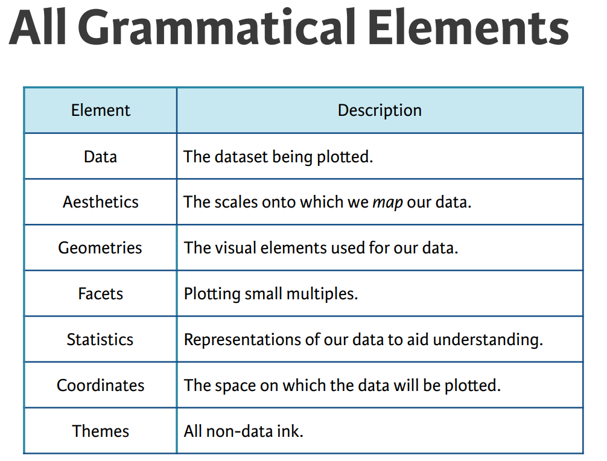
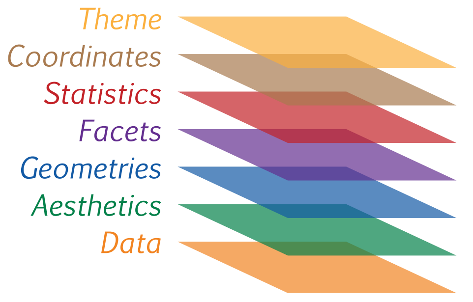

# An Introduction to ggplot2

* Visualizations (graphical representations) of data is a key step in being able to communicate information and findings to others. In this module you will learn to use the ggplot2 library to declaratively make beautiful plots or charts of your data. Although R does provide built-in plotting functions, the ggplot2 library implements the Grammar of Graphics. This makes it particularly effective for describing how visualizations should represent data, and has turned it into the preeminent plotting library in R.

# Grammar of Graphics

* Just as the grammar of language helps us construct meaningful sentences out of words, the Grammar of Graphics helps us to construct graphical figures out of different visual elements. This grammar gives us a way to talk about parts of a plot: all the circles, lines, arrows, and words that are combined into a diagram for visualizing data. The components of a plot are :

    * the data being plotted
    * the geometric objects (circles, lines, etc.) that appear on the plot
    * a set of mappings from variables in the data to the aesthetics (appearance) of the geometric objects
    * a statistical transformation used to calculate the data values used in the plot
    * a position adjustment for locating each geometric object on the plot
    * a scale (e.g., range of values) for each aesthetic mapping used
    * a coordinate system used to organize the geometric objects
    * the facets or groups of data shown in different plots

* These components are organized into layers, where each layer has a single geometric object, statistical transformation, and position adjustment. Following this grammar, you can think of each plot as a set of layers of images, where each image's appearance is based on some aspect of the data set.






* Today we'll be looking at the mpg dataset and explore it visually using ggplot2

* This dataset provides "Fuel economy data from 1999 and 2008 for 38 popular models of cars". The dataset is shipped with ggplot2 package.

* Import the dataset into R

```{r}

# Load ggplot2 library
library(ggplot2)

```

* Look at the structure of the dataset

```{r}
str(mpg)
```

```{r}
dim(mpg)
head(mpg)
```

* In order to create a plot, you:

    * Call the ggplot() function which creates a blank canvas.
    * Specify aesthetic mappings, which specifies how you want to map variables to visual aspects. In this case we are simply mapping the displ and hwy variables to the x- and y-axes.
    * You then add new layers that are geometric objects which will show up on the plot. In this case we add geom_point to add a layer with points (dot) elements as the geometric shapes to represent the data.
    
```{r}

# create canvas
ggplot(data = mpg) + ggtitle("Canvas")

```

```{r}
# variables of interest mapped

ggplot(data=mpg, mapping = aes(x = displ, y = hwy)) + ggtitle("Canvas + variables mapped to axis")

```
 
# Key components

* Every ggplot2 plot has three key components:

   * data,

   * A set of aesthetic mappings between variables in the data and visual properties, and

 
   * At least one geom, geometric object, which describes how to render each observation.

# Univariate Plots
## Barplot

* To visualize one categorical variable

```{r}

ggplot(data = mpg, aes(x = as.factor(year))) +
  geom_bar(fill="grey") +
xlab("Year")
```


```{r}

table(mpg$class)

```

```{r}
# Right column: no y mapping needed!

ggplot(data = mpg, aes(x = class)) +
  geom_bar(fill="blue") +
xlab("Vehicle Class") +
  ylab("Count") 

```

* Flipping the co-ordinates
  
```{r}

#flip x and y axis with coord_flip
ggplot(mpg, aes(x = class)) +
  geom_bar(fill="blue") +
  coord_flip()

```


```{r}
ggplot(data=mpg,aes(x=manufacturer)) + geom_bar(aes(fill = class)) +
  coord_flip()

```


## Histograms and frequency polygons
* Histograms and freqency polygons show the distribution of a single variable. They provide more information about the distribution of a single group.

```{r}

ggplot(data = mpg, aes(x = hwy)) +
  geom_histogram(fill="red")
  
```

```{r}
ggplot(mpg, aes(hwy)) + 
  geom_histogram()
ggplot(mpg, aes(hwy)) + 
  geom_freqpoly()

```

* Both histograms and frequency polygons work in the same way: they bin the data, then count the number of observations in each bin. The only difference is the display: histograms use bars and frequency polygons use lines.

* How do we decide on bin width?

```{r}

ggplot(mpg, aes(hwy)) + 
  geom_histogram(binwidth = 1, fill="green")

```

* Bin width choice is not trivial - driven by domain

```{r}
library(gridExtra)
library(ggridges)

p1 <- ggplot(mpg, aes(hwy)) +
  geom_histogram(binwidth = 1) +
  ggtitle("Bin width = 1 Mile")

p2 <- ggplot(mpg, aes(hwy)) +
  geom_histogram(binwidth = 10) +
  ggtitle("Bin width = 10 Miles")

p3 <- ggplot(mpg, aes(hwy)) +
  geom_histogram(binwidth = 20) +
  ggtitle("Bin width = 20 Miles")

p4 <- ggplot(mpg, aes(hwy)) +
  geom_histogram(binwidth = 30) +
  ggtitle("Bin width = 30 Miles")

grid.arrange(p1, p2, p3, p4, ncol = 2)
```


* To compare the distributions of different subgroups, you can map a categorical variable to either fill (for geom_histogram()) or colour (for  geom_freqpoly()).

```{r}
ggplot(mpg, aes(displ, colour = drv)) + 
  geom_freqpoly(binwidth = 0.5)

ggplot(mpg, aes(displ, fill = drv)) + 
  geom_histogram(binwidth = 0.5)
```
  
# Multivariate Plots

## Scatter Plot

* This produces a scatterplot defined by:

    * Data: mpg.
    * Aesthetic mapping: engine size mapped to x position, fuel economy to y position.
    Geom: points.

* Note that when you added the geom layer you used the addition (+) operator. As you add new layers you will always use + to add onto your visualization.

* Observation - The plot shows a strong correlation: as the engine size gets bigger, the fuel economy gets worse.

* The following code is identical to the example above

```{r}
ggplot(mpg, aes(displ, hwy)) + 
  geom_point() +
  ggtitle("Data plotted between hwy and displ")
  
```

## Aesthetic Mappings - Colour, size, shape and other aesthetic attributes

* The aesthetic mappings take properties of the data and use them to influence visual characteristics, such as position, color, size, shape, or transparency. Each visual characteristic can thus encode an aspect of the data and be used to convey information. 

* All aesthetics for a plot are specified in the aes() function call (later in this tutorial you will see that each geom layer can have its own aes specification). 

* For example, we can add a mapping from the class of the cars to a color characteristic:

```{r}
table(mpg$class)
unique(mpg$class)
ggplot(mpg, aes(x = displ, y = cty, color = class)) +
  geom_point()

```

* Observation - This gives each point a unique colour corresponding to its class. The legend allows us read data values from the colour, showing us that the group of cars with unusually high fuel economy for their engine size are two seaters: cars with big engines, but lightweight bodies.

* Note that using the aes() function will cause the visual channel to be based on the data specified in the argument. For example, using aes(color = "blue") won't cause the geometry's color to be "blue", but will instead cause the visual channel to be mapped from the vector c("blue") - as if we only had a single type of engine that happened to be called "blue". 

* Alternate Approaches

```{r}
ggplot(mpg, aes(x = displ, y = cty, size = class)) +
  geom_point()

ggplot(mpg, aes(x = displ, y = cty, alpha = class)) +
  geom_point()

```


* If you wish to apply an aesthetic property to an entire geometry, you can set that property as an argument to the geom method, outside of the aes() call:

```{r}

ggplot(mpg, aes(x = displ, y = cty)) +
  geom_point(color = "blue")

```

* To add additional variables to a plot, we can use other aesthetics like colour, shape, and size. These work in the same way as the x and y aesthetics are added into the call to aes().

```{r}

table(mpg$drv)
unique(mpg$drv)
ggplot(mpg, aes(x = displ, y = hwy, color=drv, shape = as.factor(cyl))) +
  geom_point(size=2)

```

* Different types of aesthetic attributes work better with different types of variables. For example, colour and shape work well with categorical variables, while size works well for continuous variables.

## Boxplot

* Let???s compare the box plots of city mileage for the two types

```{r}
unique(mpg$class)
```

```{r}

boxplot(cty~class,data=mpg, main="City Mileage Data", 
  	xlab="Vehicle Class", ylab="City Mileage",cex.axis=0.75)

ggplot(mpg, aes(class, cty,fill=class)) + 
  geom_boxplot()

```

# Output
* Most of the time you create a plot object and immediately plot it. But you can also save a plot to a variable and manipulate it.

```{r}

p <- ggplot(mpg, aes(displ, hwy, colour = factor(cyl))) +
  geom_point()

```

* Once you have a plot object, there are a few things you can do with it:

* Render it on screen, with print(). This happens automatically when running interactively, but inside a loop or function, you???ll need to  print() it yourself.

```{r}
print(p)
```

* Save it to disk, with ggsave()

```{r}
# Save png to disk
ggsave("plot.png", width = 5, height = 5)

```

# Specifying Geometric Shapes

* Building on these basics, ggplot2 can be used to build almost any kind of plot you may want. These plots are declared using functions that follow from the Grammar of Graphics. The most obvious distinction between plots is what geometric objects (geoms) they include. 

* ggplot2 supports a number of different types of geoms, including: 
  1) geom_point for drawing individual points (e.g., a scatter plot)
  2) geom_line for drawing lines (e.g., for a line charts) 
  3) geom_smooth for drawing smoothed lines (e.g., for simple trends or approximations) 
  4) geom_bar for drawing bars (e.g., for bar charts) 
  5) geom_histogram for drawing binned values (e.g. a histogram) 
  6) geom_polygon for drawing arbitrary shapes 
  7) geom_map for drawing polygons in the shape of a map! (You can access the data to use for these maps by using the map_data() function).

```{r}
ggplot(mpg, aes(x = displ, y = hwy)) +
  geom_smooth()

```

* This overlays the scatterplot with a smooth curve, including an assessment of uncertainty in the form of point-wise confidence interval shown in grey.

* An important argument to geom_smooth() is the method, which allows you to choose which type of model is used to fit the smooth curve.

* method = "loess", the default for small n, uses a smooth local regression. 

```{r}
ggplot(mpg, aes(x = displ, y = hwy)) +
  geom_smooth(se=FALSE)

```

```{r}

# color aesthetic specified for only the geom_point layer
ggplot(mpg, aes(x = displ, y = hwy)) +
  geom_point(aes(color = class)) +
  geom_smooth(se = FALSE)

```

# Statistical Transformations

If you look at the below bar chart, you'll notice that the the y axis was defined for us as the count of elements that have the particular type. This count isn't part of the data set (it's not a column in mpg), but is instead a statistical transformation that the geom_bar automatically applies to the data. In particular, it applies the stat_count transformation.

```{r}

ggplot(mpg, aes(x = class)) +
  geom_bar(fill='blue')
```

* ggplot2 supports many different statistical transformations. For example, the "identity" transformation will leave the data "as is". You can specify which statistical transformation a geom uses by passing it as the stat argument. For example, consider our data already had the count as a variable:

```{r}

class_count <- dplyr::count(mpg, class)
class_count

```

* We can use stat = "identity" within geom_bar to plot our bar height values to this variable. Also, note that we now include n for our y variable:
scale_y_continuous(labels = scales::percent)scale_y_continuous(labels = scales::percent)
```{r}

library(dplyr)

ggplot(class_count, aes(x = class, y = n)) +
  geom_bar(stat = "identity")

# An example would be if you want to sort the levels of bar chart!

# What if what I want to sort by frequency in the plot?

class_drive <- mpg %>% group_by(class) %>% summarize(freq = n())
  
ggplot(class_drive, aes(reorder(class, freq), freq)) +
geom_bar(stat= "identity") +
ggtitle("Total count")
```

* Display percentage values on bar chart

```{r}
library(tidyverse)
library(scales)

class_drive <- mpg %>% group_by(class) %>% summarize(count = n())%>% mutate(percentage = count/sum(count))  # find percent of total

class_drive


ggplot(class_drive, aes(class, percentage, fill = class)) + 
  geom_bar(stat = "identity") +
  geom_text(aes(label=scales::percent(percentage)), position = position_stack(vjust = .5))+
  scale_y_continuous(labels = scales::percent)
```


* We can also call stat_ functions directly to add additional layers. For example, here we create a scatter plot of highway miles for each displacement value and then use stat_summary to plot the mean highway miles at each displacement value.

```{r}

ggplot(mpg, aes(displ, hwy)) + 
  geom_point(color = "green") + 
  stat_summary(fun.y = "mean", geom = "line", size = 1, linetype = "dashed")

```

* Multiple stats available

```{r}
ggplot(data = mpg) + 
  stat_summary(mapping = aes(x = class, y = hwy),fun.ymin = min,fun.ymax = max,fun.y = median)
```


## Position Adjustments

In addition to a default statistical transformation, each geom also has a default position adjustment which specifies a set of "rules" as to how different components should be positioned relative to each other. This position is noticeable in a geom_bar if you map a different variable to the color visual characteristic:

```{r}
# bar chart of class, colored by drive (front, rear, 4-wheel)

ggplot(mpg, aes(x = class, fill = drv)) + 
  geom_bar()

```

* The geom_bar by default uses a position adjustment of "stack", which makes each rectangle's height proprotional to its value and stacks them on top of each other. We can use the position argument to specify what position adjustment rules to follow:

```{r}

# bar chart of class, colored by drive (front, rear, 4-wheel)
# position = "dodge": values next to each other
ggplot(mpg, aes(x = class, fill = drv)) + 
  geom_bar(position = "dodge")

```

* Bar Chart - To visualize two categorical variables

```{r}
# position = "fill": percentage chart
ggplot(mpg, aes(x = class, fill = drv)) + 
  geom_bar(position = "fill")

```

* Avoid overplotting using jitter

```{r}
ggplot(data = mpg) + 
  geom_point(mapping = aes(x = displ, y = hwy), position = "jitter") 
```


# Managing Scales

* Whenever you specify an aesthetic mapping, ggplot uses a particular scale to determine the range of values that the data should map to. Thus when you specify: 

```{r}
# color the data by engine type
ggplot(mpg, aes(x = displ, y = hwy, color = class)) +
  geom_point()

```

* ggplot automatically adds a scale for each mapping to the plot.

```{r}
# same as above, with explicit scales

ggplot(mpg, aes(x = displ, y = hwy, color = class)) +
  geom_point() +
  scale_x_continuous("Engine Displacement") +
  scale_y_continuous("Highway Mileage") +
  scale_colour_discrete()
```


* Each scale can be represented by a function with the following name: scale_, followed by the name of the aesthetic property, followed by an _ and the name of the scale. A continuous scale will handle things like numeric data (where there is a continuous set of numbers), whereas a discrete scale will handle things like colors (since there is a small list of distinct colors).

* A common parameter to change is which set of colors to use in a plot. While you can use the default coloring, a more common option is to leverage the pre-defined palettes from colorbrewer.org. These color sets have been carefully designed to look good and to be viewable to people with certain forms of color blindness. We can leverage color brewer palletes by specifying the scale_color_brewer() function, passing the pallete as an argument.

```{r}
# default color brewer
ggplot(mpg, aes(x = displ, y = hwy, color = class)) +
  geom_point() +
  scale_color_brewer()
```

```{r}

# specifying color palette
ggplot(mpg, aes(x = displ, y = hwy, color = class)) +
  geom_point() +
  scale_color_brewer(palette = "Set3") # Change palette = "RdBu" and notice

```

* Note that you can get the palette name from the colorbrewer website by looking at the scheme query parameter in the URL. Or see the diagram here and hover the mouse over each palette for the name.

* You can also specify continuous color values by using a gradient scale, or manually specify the colors you want to use as a named vector.

# Coordinate Systems

* The next term from the Grammar of Graphics that can be specified is the Coordinate system. As with scales, coordinate systems are specified with functions that all start with coord_ and are added as a layer. There are a number of different possible coordinate systems to use, including:

  * coord_cartesian the default cartesian coordinate system, where you specify x and y values (e.g. allows you to zoom in or out).
  * coord_flip a cartesian system with the x and y flipped
  * coord_fixed a cartesian system with a "fixed" aspect ratio (e.g., 1.78 for a "widescreen" plot)
   * coord_polar a plot using polar coordinates
   * coord_quickmap a coordinate system that approximates a good aspect ratio for maps. See documentation for more details.
   
```{r}

# zoom in with coord_cartesian
ggplot(mpg, aes(x = displ, y = hwy)) +
  geom_point() +
  coord_cartesian(xlim = c(0, 5))

```

* You can even use polar coordinates!

```{r}
bar <- ggplot(data = mpg) + 
  geom_bar(mapping = aes(x = class, fill = class), show.legend = FALSE,width = 1) + 
  theme(aspect.ratio = 1) +
  labs(x = NULL, y = NULL)

# bar + coord_flip()
bar + coord_polar()
```


# Facets

* Facets are ways of grouping a data plot into multiple different pieces (subplots). This allows you to view a separate plot for each value in a categorical variable. You can construct a plot with multiple facets by using the facet_wrap() function. This will produce a "row" of subplots, one for each categorical variable (the number of rows can be specified with an additional argument):

```{r}

ggplot(mpg, aes(x = displ, y = hwy)) +
  geom_point(colour="blue") +
  facet_wrap(~ class, nrow=2)

```

* You can also facet_grid to facet your data by more than one categorical variable. Note that we use a tilde (~) in our facet functions. With facet_grid the variable to the left of the tilde will be represented in the rows and the variable to the right will be represented across the columns.

```{r}

ggplot(mpg, aes(x = displ, y = hwy)) +
  geom_point(color="red") +
  facet_grid(year ~ cyl)

```

# Labels & Annotations

* Textual labels and annotations (on the plot, axes, geometry, and legend) are an important part of making a plot understandable and communicating information. ggplot makes it easy to add such annotations.

* You can add titles and axis labels to a chart using the labs() function (not labels, which is a different R function!):

```{r}

ggplot(mpg, aes(x = displ, y = hwy, color = class)) +
  geom_point() +
  labs(title = "Fuel Efficiency by Engine Power",
       subtitle = "Fuel economy data from 1999 and 2008 for 38 popular models of cars",
       x = "Engine power (litres displacement)",
       y = "Fuel Efficiency (miles per gallon)",
       color = "Car Type")


```


* Adding theme

```{r}


ggplot(mpg, aes(x = displ, y = hwy, color = class)) +
  geom_point() +
  labs(title = "Fuel Efficiency by Engine Power",
       subtitle = "Fuel economy data from 1999 and 2008 for 38 popular models of cars",
       x = "Engine power (litres displacement)",
       y = "Fuel Efficiency (miles per gallon)",
       color = "Car Type") +
      theme_classic()


```


### References

* https://r4ds.had.co.nz/data-visualisation.html#introduction-1